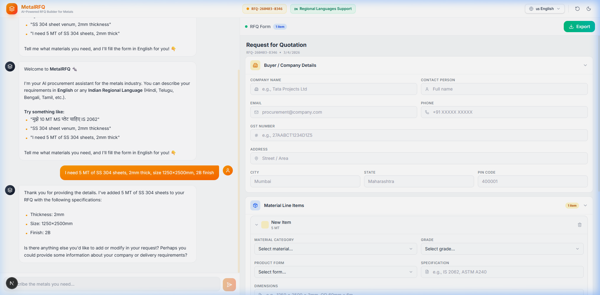
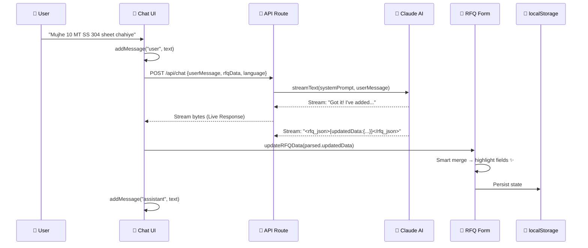

# 🔩 MetalRFQ: AI-Powered Metal Procurement Generator

**MetalRFQ** is a production-ready AI assistant designed for the Indian metals industry. It uses natural language processing to extract structured procurement data from chat conversations and generates industrial-grade Request for Quotation (RFQ) documents in real-time.



---

## 🏗️ Project Architecture (Layered Overview)

The application is structured into five core layers, ensuring a separation of concerns and a seamless data flow.

### 1. Foundation (Types & Utilities)
*   **`src/types/rfq.ts`**: The master blueprint defining the structure of Buyer Info, Line Items (materials, dimensions, quantities), and the complete RFQ object.
*   **`src/lib/rfq-defaults.ts`**: Provides the initial empty state and logic for generating professional RFQ numbers based on date and unique identifiers.

### 2. AI Brain (Prompt Engineering & Bedrock)
*   **`src/lib/rfq-prompts.ts`**: The "Intelligence Center" containing the system prompt and data minification logic ($Token Savings$).
*   **`src/app/api/chat/route.ts`**: Backend handler using **Claude 3.5 Sonnet (via AWS Bedrock)** with streaming responses and real-time cost tracking.

### 3. State Management (The Orchestrator)
*   **The Central Brain (`use-rfq-store.ts`)**: A custom React hook that manages the unified RFQ state, chat history, and highlights. Features a **Smart Merge** algorithm that allows AI to update specific fields without deleting existing data.
*   **Persistence**: Automatically syncs the entire RFQ form to `localStorage`, protecting your data across browser refreshes.

### 4. UI Components (Frontend)
*   **`rfq-builder.tsx`**: The main orchestrator connecting the Chat UI with the Form panel.
*   **Interactive Form**: A rich, multi-section form (`rfq-form-panel.tsx`) that features "Golden Glow" highlights when the AI extracts and updates data.
*   **Multi-Language Support**: Support for English + 12 Indian regional languages, while always extracting data in standardized English.

### 5. Export (PDF & CSV)
*   **Professional PDF Template**: Uses a hidden "Bill-Style" template (`rfq-bill-template.tsx`) to generate high-quality industrial documents using `html2canvas` and `jsPDF`.
*   **Data Portability**: Option to export structured RFQ data directly to CSV for ERP/Excel integration.

---

## 🔄 Core Data Flow

The following diagram illustrates how MetalRFQ processes a simple user message into a complex procurement item:



---

## ✨ Key Features

- **💬 Conversational UI**: Talk to the RFQ builder in Hindi, English, or any major Indian language.
- **🧠 Accurate Data Extraction**: Automatically identifies material grades (SS 304, MS E250), dimensions (Thickness, OD, Wall Thickness), and quantities (MT, KG).
- **📝 Real-time Synchronized Form**: Manual edits and AI updates work in perfect harmony.
- **📄 Industrial-Grade Export**: Professional bill-style layout designed for B2B procurement standards.
- **💰 Token Optimization**: Custom minification logic reduces AI costs by 60%+ by stripping empty fields from API requests.

---

## 🛠️ Getting Started

### 1. Prerequisites
- **AWS Credentials**: Access to Amazon Bedrock with Claude 3.5 Sonnet enabled.
- **Node.js**: v18.x or later.

### 2. Installation & Setup
```bash
npm install
# or
pnpm install
```

Create a `.env.local` file:
```bash
AWS_ACCESS_KEY_ID=your_access_key
AWS_SECRET_ACCESS_KEY=your_secret_key
AWS_REGION=your_region (e.g. us-east-1)
```

### 3. Run Development
```bash
npm run dev
```

---

## 📄 Documentation Reference
- **Types**: See `src/types/rfq.ts`
- **Prompts**: See `src/lib/rfq-prompts.ts`
- **State**: See `src/hooks/use-rfq-store.ts`

© 2026 MetalRFQ • Built for the Indian Metal Industry
