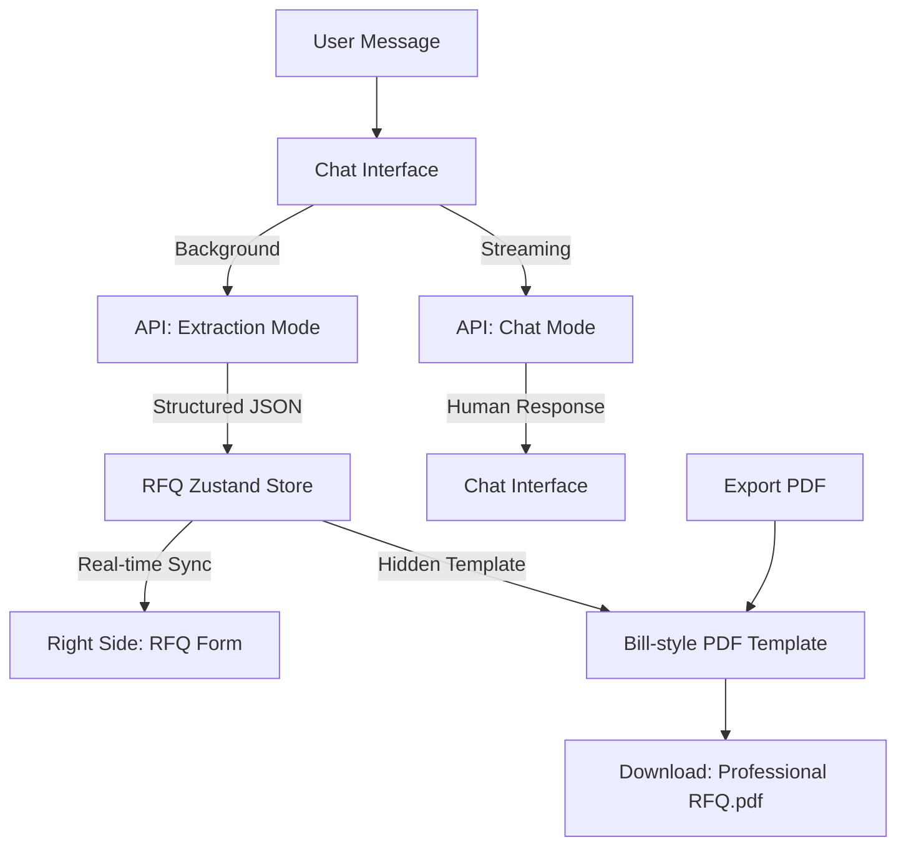

# 🔩 RFQ-Builder: AI-Powered Metal Procurement Generator

A production-ready AI assistant for the Indian metals industry. **MetalRFQ** uses natural language processing to extract structured procurement data from chat conversations and generates industrial-grade Request for Quotation (RFQ) documents in real-time.

---

## ✨ Features

- **💬 Conversational RFQ Building**: Describe your material needs (e.g., "10 MT of SS 304 sheets, 2mm thick") and watch the form populate automatically.
- **🧠 Dual-Stream AI Architecture**:
    - **Extraction Mode**: Background processing that identifies grades, categories, dimensions, and quantities from text.
    - **Chat Mode**: A helpful assistant that guides you through the procurement steps and Indian industry standards.
- **📄 Professional "Bill-Style" Export**:
    - Generates a high-quality PDF with a professional invoice/bill layout.
    - Structured tables for line items, delivery terms, and commercial conditions.
    - Standardized formatting for easy sharing with suppliers.
- **📊 Indian Metal Market Optimization**: Pre-configured with Indian metal categories (MS, SS, Aluminium, Brass), standard grades (IS 2062, ASTM A240), and local commercial terms (GST, Incoterms, Mill TC).
- **🌓 Modern UI/UX**: Sleek split-panel interface with full Dark Mode support, real-time highlights for AI-updated fields, and mobile-responsive tabs.
- **💰 Usage Tracking**: Real-time token usage and cost monitoring for transparent AI operations.

---

## 🏗️ Architecture & Tech Stack

| Layer            | Technology |
|------------------|-----------|
| **Framework**    | [Next.js 15](https://nextjs.org/) (App Router) |
| **Styling**      | [Tailwind CSS](https://tailwindcss.com/) |
| **AI SDK**       | [Vercel AI SDK](https://sdk.vercel.ai/) |
| **Model**        | [Amazon Bedrock](https://aws.amazon.com/bedrock/) (Anthropic Claude Sonnet) |
| **State Management** | [Zustand](https://zustand-demo.pmnd.rs/) with Persistence |
| **Icons**        | [Lucide React](https://lucide.dev/) |
| **PDF Generation**| `html2canvas-pro` + `jspdf` (Professional Bill Template) |

---

## 🧠 The "Brain": Dual-Stream Processing

MetalRFQ uses a specialized parallel processing model to ensure a fluid user experience.



---

## 🛠️ Getting Started

### 1. Prerequisites
- **AWS Credentials**: Access to Amazon Bedrock with Claude 3.5 Sonnet enabled.
- **Node.js**: v18.x or later.

### 2. Installation
```bash
npm install
# or
pnpm install
```

### 3. Environment Setup
Create a `.env.local` file in the root directory:
```bash
AWS_ACCESS_KEY_ID=your_access_key
AWS_SECRET_ACCESS_KEY=your_secret_key
AWS_REGION=your_region (e.g. us-east-1)
```

### 4. Run Development Server
```bash
npm run dev
```
Open [http://localhost:3000](http://localhost:3000).

---

## 📄 Documentation

- **RFQ Data Structure**: Defined in `src/types/rfq.ts`.
- **System Prompts**: Industrial logic found in `src/lib/rfq-prompts.ts`.
- **Export Template**: Custom bill styling in `src/components/rfq-bill-template.tsx`.

## 🚀 Roadmap
- [ ] Multi-supplier matching based on material grade.
- [ ] Integration with ERP systems (SAP/Oracle).
- [ ] Historical price trend analysis for Indian metal markets.
- [ ] WhatsApp integration for receiving RFQs.

---

© 2026 MetalRFQ • Professional Procurement Excellence
